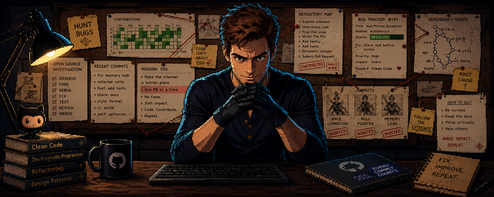
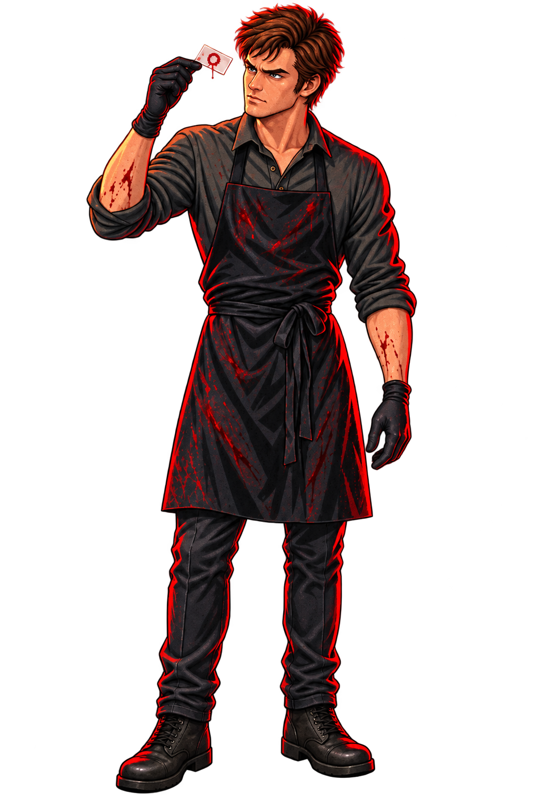

<!-- ═══════════════════════ COVER ═══════════════════════ -->

<p align="center">
  
</p>

<h1 align="center">Talha&nbsp;Rizwan</h1>

<p align="center">
  <code>SOFTWARE&nbsp;ENGINEER</code> &nbsp;·&nbsp; <code>FRONTEND&nbsp;SPECIALIST</code> &nbsp;·&nbsp; <code>UI/UX</code>
</p>

<p align="center">
  
</p>

<p align="center">
  <a href="https://ta-lha-riz-wan.vercel.app">
    
  </a>
  <a href="mailto:work.talharizwan@gmail.com">
    
  </a>
  <a href="https://www.linkedin.com/in/talha-rizwan-986552371/">
    
  </a>
  
</p>


<!-- ═══════════════════════ CASE FILE ═══════════════════════ -->

<h2 align="center">🩸 &nbsp;CASE FILE #001 — THE DEVELOPER</h2>



**Subject:** Talha Rizwan &nbsp;·&nbsp; **Status:** `SHIPPING`

A final-year **Software Engineering** student at FAST NUCES, Islamabad. By day I build
high-performance, visually engaging web applications. By night I hunt the bugs
that made it past review.

```
> Frontend .......  React · Next.js · GSAP · Tailwind
> Backend ........  Node.js · Flask · REST APIs
> Obsessions .....  motion, micro-interactions, sub-second loads
> Investigating ..  AI apps · gamified learning · quality engineering
```

Every merged PR is a slide in the archive. I keep the collection tidy —
**clean code, reliable software, and interfaces that feel effortless.**

<br clear="right"/>


<!-- ═══════════════════════ TOOLS ═══════════════════════ -->

<h2 align="center">🔪 &nbsp;THE TOOL KIT</h2>

<p align="center">
  
</p>
<p align="center">
  
</p>
<p align="center">
  
</p>

<p align="center">
  
  &nbsp;&nbsp;&nbsp;
  
  &nbsp;&nbsp;&nbsp;
  
  &nbsp;&nbsp;&nbsp;
  
</p>


<!-- ═══════════════════════ FORENSICS (self-hosted cards) ═══════════════════════ -->

<h2 align="center">🔬 &nbsp;FORENSIC REPORT</h2>

<p align="center"><i>Cards below are generated from my own repo data and rebuilt nightly — no third-party card hosts.</i></p>

<p align="center">
  
  &nbsp;
  
</p>

<p align="center">
  
  &nbsp;
  
</p>

<h3 align="center">📉 &nbsp;VOLUME ANALYSIS</h3>

<p align="center">
  
</p>

<p align="center">
  
</p>

<p align="center">
  
</p>

<p align="center">
  
</p>

<h3 align="center">📈 &nbsp;ACTIVITY TIMELINE</h3>

<p align="center">
  
</p>


<!-- ═══════════════════════ EVIDENCE ═══════════════════════ -->

<h2 align="center">📁 &nbsp;EVIDENCE — SELECTED WORK</h2>

<table align="center">
  <tr>
    <td width="50%" valign="top">
      <h4>🌱 &nbsp;DeliveTree</h4>
      <p>Full-stack startup platform — end-to-end product build.</p>
      <sub><code>Next.js</code> <code>Node.js</code> <code>MongoDB</code></sub>
    </td>
    <td width="50%" valign="top">
      <h4>🎮 &nbsp;Sqalify</h4>
      <p>Gamified SQA learning platform that makes testing addictive.</p>
      <sub><code>React</code> <code>GSAP</code> <code>Express</code></sub>
    </td>
  </tr>
  <tr>
    <td width="50%" valign="top">
      <h4>📄 &nbsp;DocIntel</h4>
      <p>AI-powered contract analysis — clauses, risk, and red flags.</p>
      <sub><code>Flask</code> <code>LLM</code> <code>Tailwind</code></sub>
    </td>
    <td width="50%" valign="top">
      <h4>📊 &nbsp;ResumeAI</h4>
      <p>Resume analysis and job matching with scored feedback.</p>
      <sub><code>Next.js</code> <code>Python</code> <code>REST</code></sub>
    </td>
  </tr>
</table>


<!-- ═══════════════════════ ARCADE ═══════════════════════ -->

<h2 align="center">🕹 &nbsp;THE HUNT — CONTRIBUTION ARCADE</h2>

<p align="center"><i>My contribution grid, played four different ways. Regenerated nightly.</i></p>

<h3 align="center">🐍 &nbsp;Snake</h3>

<p align="center">
  <picture>
    <source media="(prefers-color-scheme: dark)" srcset="https://raw.githubusercontent.com/Cypher-Aura-19/Cypher-Aura-19/output/snake-dark.svg">
    <source media="(prefers-color-scheme: light)" srcset="https://raw.githubusercontent.com/Cypher-Aura-19/Cypher-Aura-19/output/snake.svg">
    
  </picture>
</p>

<h3 align="center">👻 &nbsp;Pac-Man</h3>

<p align="center">
  <picture>
    <source media="(prefers-color-scheme: dark)" srcset="https://raw.githubusercontent.com/Cypher-Aura-19/Cypher-Aura-19/output/pacman-contribution-graph-dark.svg">
    <source media="(prefers-color-scheme: light)" srcset="https://raw.githubusercontent.com/Cypher-Aura-19/Cypher-Aura-19/output/pacman-contribution-graph.svg">
    
  </picture>
</p>

<h3 align="center">🧱 &nbsp;Breakout</h3>

<p align="center">
  <picture>
    <source media="(prefers-color-scheme: dark)" srcset="https://raw.githubusercontent.com/Cypher-Aura-19/Cypher-Aura-19/output/breakout-contribution-graph-dark.svg">
    <source media="(prefers-color-scheme: light)" srcset="https://raw.githubusercontent.com/Cypher-Aura-19/Cypher-Aura-19/output/breakout-contribution-graph.svg">
    
  </picture>
</p>

<h3 align="center">🚀 &nbsp;Galaga</h3>

<p align="center">
  <picture>
    <source media="(prefers-color-scheme: dark)" srcset="https://raw.githubusercontent.com/Cypher-Aura-19/Cypher-Aura-19/output/galaga-contribution-graph-dark.svg">
    <source media="(prefers-color-scheme: light)" srcset="https://raw.githubusercontent.com/Cypher-Aura-19/Cypher-Aura-19/output/galaga-contribution-graph.svg">
    
  </picture>
</p>


<!-- ═══════════════════════ CODE ═══════════════════════ -->

<h2 align="center">🧬 &nbsp;THE CODE</h2>

<p align="center">
  
</p>

<p align="center">
  <sub><code>ANALYZE. &nbsp;CONTRIBUTE. &nbsp;IMPROVE. &nbsp;REPEAT.</code></sub>
</p>

<p align="center">
  <i>⭐ I build fast, scalable & visually stunning digital experiences.</i>
</p>


